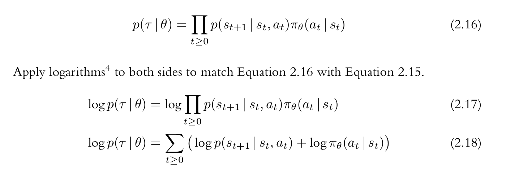

+ REINFORCE的推导还是比较直观的。记住我们之前提到的，Agent是一个无主见的东西，他需要根据Policy的内容进行Action的选择。但是Agent选择哪一个呢？这就需要奖励机制的存在，从而训练Policy在看到某个State的时候，选择一个使得Reward高的Action。

+ 这里我们将上面的陈述写成数学表达式的形式，这里 $$ Reward=r(s_t,a_t) $$ 表示在某个state选择某个action后得到的reward，那么累计得分 $$ R( t ) = \sum_{t=0}^{T} r_t $$ 但是这还不够。我们以走迷宫为例，假设我们只有走出迷宫之后才能得分。在这种情况下，Agent可能在尝试少量的次数之后走出了迷宫，会得到一分；也可能尝试很多次才走出迷宫，也会得到一分。如果只是从获得的分数值来看的话，他们是没区别的。但是两次来看的话，明显花费更少时间的policy更好。所以，为了弥补这种reward的计算方式，通常会做一个加权，即对于更长时间距离下的reward，减少他在总体中的贡献，这通常被称为折扣因子(叫什么不重要)。那么修正之后的 $$ R( t ) = \sum_{t=0}^{T} \gamma ^t r_t $$ 这样，有了加权之后，后续的值将变得越来越不重要，就能迫使Policy不仅要考虑得分，还要考虑得分的时机。在这个过程中，像 $ s_0, a_0, r_0, s_1 , a_1, r_1, ... $ 这个在过程中得到的state,action,reward值通常被称为trajectory，通常用 $ \tau $ 来表示 。

+ 另外还有Policy，因为我们这里主要讨论Deep Reinforcement Learning，所以它通常就是一个DNN。在RL中，通常通过 $ \pi_\theta $ 来表示，其中 $ \theta $ 表示其中的参数。


+ 有了Reward的表示之后，我们就可以一步步推导出REINFORCE的objective function了。我们的目的是要让这个Reward越高越好对吧。但是如果你观察R的表达式的话会发现，他似乎和Policy没有明确的关系，那么如何来优化呢？注意，R在计算时是基于state和action的。state是来自Env的，而action则是来自于Policy的。从这一点出发，我们就可以写出REINFORCE的objective function了。

+ 通过上面的介绍，REINFORCE的Object function 就可以表示为: 

$$ J( \pi_\theta ) =\int \pi_\theta R(t) d\tau $$ 
这里编辑公式太麻烦了，所以我这里直接截图来解释了，下面从2-7到2-13是数学期望的定义，其实也就是这个 $ J $ 的定义，只是换了一个参数

上面的期望中，用到了下面这个技巧

将期望展开里边的那个 $ f(x) $ 替换为 $ Reward $ ，就可以得到

然后，里边的p其实是由trajectory $ \tau $ 和 $ \theta $多次产生的，可以表示为


那么，最终的Objective function最终的形式就是


+ 然后，你就可以通过这个训练你的Policy了，但在这之前，我们仍然需要回答一些问题。你可能会在某些资料里边看到说REINFORCE的采样过程是Mente Carlo的，也就是随机的。这里主要是因为他的action采样，是基于policy的输出，从而构造一个概率分布，然后进行随机采样产生的(你也可以将这看做一个随机过程)。这种随机采样的方法是为了让agent能够对Env进行探索，从而分析出最优策略。当然，你可能觉得这个解释不够清晰。别急，后面的内容还会用到这一策略。

+ 如果你对于上面的公式推导感到十分困惑，那我们直接看代码，然后来解释。

+ 先注意我们的objective function，在计算policy gradient的时候，我们需要reward和log probability。所以，我们需要存储reward和log_prob。那么需要先定义一些变量

```python

gamma = .99
log_probs = []
rewards = []

```

+ 之后，我们的Policy则是一个DNN。这里我们定义一个十分简单的MLP。他的输入和输出会根据Env的情况而定。

```python

class Policy( torch.nn.Module ):

    def __init__(self, in_dim , out_dim):

        super( Policy , self ).__init__()

        self.linear1 = torch.nn.Linear( in_dim , 128 );
        self.linear2 = torch.nn.Linear( 128 , 128 );
        
        self.linear = torch.nn.Linear( 128 , out_dim );

    def forward( self , x ):
        
        feature = x;
        feature = F.relu( self.linear1( feature ) );
        feature = F.relu( self.linear2( feature ) );
        
        return self.linear( feature );
```


+ 接着我们需要创建这个Env，并通过sample action来让他运行起来。这里面需要对部分代码做出解释。在while循环中，我们首先通过policy和observation来计算出一个logits。然后通过他来生成一个Categorical分布。这其实就和我们的分类模型一样，只不过这个分布实现了log_prob计算的方法，其实就是对probability 取 log。你也可以用softmax，然后自己去算log_prob。然后我们需要保存他。之后agent将会使用action。并获得一个reward。我们同样要保存他。


```python

# Initialise the environment
env = gym.make("CartPole-v1", render_mode="human")

policy = Policy( env.observation_space.shape[0] , env.action_space.n );

optimizer = torch.optim.Adam( policy.parameters() , lr = 1e-5 );

observation, info = env.reset(seed=42)

for epoch in range( 20000 ):

    terminated = False ;

    log_probs = []
    rewards = []
    terminateds = []

    observation , info = env.reset()

    policy = policy.train()

    while( not terminated ):

        logits = policy( torch.from_numpy( observation ) )

        # generate distribution and do sampling 
        dist = torch.distributions.Categorical( logits = logits )

        action = dist.sample();

        log_probs.append( dist.log_prob( action ) )

        # apply action
        observation, reward, terminated, truncated, info = env.step(action.item())

        rewards.append( reward )

    loss , reward = update( log_probs , rewards )

    optimizer.zero_grad();
    loss.backward();
    optimizer.step();

    print( f'loss : { loss.item() } , reward: { reward }' )

    test( policy , env );

env.close()

```

+ 接着我们需要调update函数来计算loss或者说的policy gradient，也就是我们之前一直提到的监督信号。

```python

def update( log_probs , rewards  ):

    n = len( rewards )

    ret = np.empty( n );

    future_return = 0;
    
    # horner algorithm 
    for t in reversed( range( n ) ):
        future_return = rewards[t] + gamma * future_return
        ret[t] = future_return ;

    prob = torch.stack( log_probs )
    ret = torch.tensor( ret )


    loss = - ( prob * ret ).sum()

    return loss , sum( rewards ); 

```

+ 这个update其实就是通过log_prob和rewards来计算policy gradient。就是我们objective function的实现，注意在计算累计reward的时候，用了一个秦久韶方法，或者叫horner法则来计算。

```python

def test( policy , env ):

    policy = policy.eval();
    observation , info = env.reset()

    done = False;

    rewards = 0;

    while( not done ):

        logits = policy( torch.from_numpy( observation ) )

        action = sample( logits )

        observation, reward, done, truncated, info = env.step(action.item())
        rewards += reward;

    print( f'testing rewards : { rewards }')

```

+ 另外则是测试代码，和training差不多，只是不计算gradient等。

+ 这就是REINFORCE的主要内容。当然，我们可以看到，这个方法会收集一整个trajectory才会对Policy进行更新，所以它又被称为on-policy的方法。当然，你在其他资料里边可能会提到这个方法有较高的方差，然后存在一些方法可以降低方差，或者使用batch training的方法。那当然属于更加先进的方法了。但是REINFORCE的主要内容也就是trainging过程中的内容了