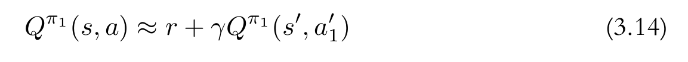

+ 这里介绍第一个基于Q-value的算法:State-Action-Reward-State-Action，简称SARSA。因为之前我们已经介绍了Q Value的一些内容，所以这里直接介绍该算法的内容，即如何计算target Q value。

+ 之前提到，Policy的输入是state，输出是对应的Q-value的估计值。而真实的Q-value则通过TD方法来进行计算。而TD的计算公式就是:

+ 这个公式的左边是我们需要计算的值，它近似等于当前的reward加上下一步折扣后的Q-value。

+ 但是，这里我们需要明确一下，因为我们后面还会提到另一个Q-value的方法DQN。他的公式和这个类似，但是存在一些区别。所以我觉得有必要在开始的时候就将这些区别说清楚。

+ 我们从SARSA中计算Q-value的公式中可以看到，我们需要计算两次action。一次是当前state下的action，他会用于和“真实”的Q-value计算误差以更新Policy。而另一次则是计算next_state的Q-value，它则用于估计“真实”的Q-value。而他们每次的action是如何产生的呢？是随机采样，还是通过argmax的方式呢？

+ 所以，这也是不同Q-learning方法的区别。在SARSA中，前后两次action的选择方式是一样的，而在我们后面介绍的DQN中，前后两次action的选择方式是不一样的。这里我们会做出一些解释为什么会选择这种方式。

+ 首先就是我们从TD的方式出发，Q-value的真实值是通过TD的方式估计的，在计算第N步的Q-value时，需要用到第N+1步的Q-value，这是一个递归关系。然后这种方式能够收敛的保证其实是我们可以探索到一个step，他可以获得一个真实的Q-value。在最开始的时候，计算的Q-value本身就是错的，那么我们如果直接选择argmax的方式，可能就会一直错下去。而为了纠正这个错误，我们就需要agent能够找到那个正确的Q-value值，所以需要agent尽可能得去探索。这个时候的action通常需要通过随机采样的方式。你在某些资料里边可能会看到在Q-learning的实现中，通常会使用$\epsilon-greedy$的方式来增强agent随机探索的能力，这个我们不做过多介绍，因为代码中的实现就是一个判断，后面直接看就行了。

+ 所以，当我们对Q-value进行估计时，通常会采用随机+最大Q-value action的方式进行。这个的目的就是刚刚上面提到的，需要让agent能够有机会对state进行探索，从而矫正Q-value值。但是对于Q-value的真实值的计算则存在不同的方法。在SARSA中，这个过程和Q-value估计值的方法是一样的，而在DQN中，则不同。这个描述起来还是过于抽象，直接从代码看。
+ 另外，这里还要介绍一个东西，就是ReplayBuffer，这个东西不是必须的，但是它可以有效加速训练过程。至于为什么，我这里做一点偏直觉的解释，可能并不是加速模型收敛的真正原因。第一个就是从统计数据的方面考虑，我们都知道，当数据足够多的时候，对于均值，方差等值的估计就会越来越准确，ReplayBuffer的其中一个作用其实就是起到缓存一定数量后再对Policy进行更新的作用，这类似于Supervised learning中的batch learning。而另一种我认为是稀疏性质，这一点是我个人认为的，我曾经问过AI相关的问题，他的解释是因为Supervised Learning的一个假设是数据是独立同分布的，如果直接使用连续的数据来进行更新的话可能会导致训练过程不稳定，而ReplayBuffer采用的是对缓存数据的随机采样，可以使得训练数据不再总是连续的几次状态。然后就是最后一点，我个人认为是Q-learning方法本身的特征，因为在REINFORCE中，Policy Gradient的计算针对一整个trajectory进行计算的(这一点可以从R的计算公式看)；而Q-learning其实只依赖当前步(input)和下一步(label)的state,action等，从这个来看的话，他的形式与一般Supervised learning几乎一样，这其实是对第一个解释的补充。

+ 到此为止，我们介绍了SARSA算法中的一些关键的东西，包括他的基本原理以及对Policy的优化方式。接下来就是代码实现。我们仍然使用之前REINFORCE使用的那套代码，只不过需要修改policy更新的方式。

```python

gamma = .99
eps = .5;
device = 'cuda'
capacity = 2048;
batch_size = 512;


```

+ 首先就是一些变量的定义，gamma大家很熟悉了，而这个eps就是上边提到的$epsilon-greedy$会用到的一个变量，以及device，如果你用CPU就写成cpu，因为我们这里的模型比较小，CPU跑起来也很快。然后就行定义我们ReplayBuffer的最大容量以及每一个batch的采样大小

```python

def softplus( x ): 
    return torch.log( torch.exp( x ) + 1 );

class Policy( torch.nn.Module ):

    def __init__(self, in_dim , out_dim):

        super( Policy , self ).__init__()

        self.linear1 = torch.nn.Linear( in_dim , 128 );

        self.linear2 = torch.nn.Linear( 128 , 256 );
        self.linear3 = torch.nn.Linear( 256 , 256 );
        self.linear4 = torch.nn.Linear( 256 , 256 );
        self.linear5 = torch.nn.Linear( 256 , 128 );
        
        self.linear = torch.nn.Linear( 128 , out_dim );

    def forward( self , x ):
        
        feature = x;
        feature = F.relu( self.linear1( feature ) );
        
        feature = F.relu( self.linear2( feature ) );
        feature = F.relu( self.linear3( feature ) );
        feature = F.relu( self.linear4( feature ) );
        feature = F.relu( self.linear5( feature ) );

        feature = softplus( self.linear( feature ) )
        
        return feature

```

+ 首先仍然是Q function网络的定义，我们仍然使用一个MLP来实现(<font color=red>严格意义来讲，它不应该叫Policy了，因为他的输出不是probability，而是Q-value的值，但是这里我就不做修改了，大家知道就好</font>)。这里需要注意一点，因为CartPole-v1这个Env的特殊性，他不会获取到负数的reward，所以，按道理来讲， 所有的Q-value其实都应该是正数，所以我们用了一个softplus来保证Q-value不小于0。当然，你可以不用，或者尝试其他保证他非负的方法。

```python


class ReplayBuffer():
    def __init__( self , capacity = 2048 , device = 'cpu' ):
        self.queue = deque( maxlen = capacity )
        self.device = device;

    def record( self , state , action , reward , next_state , next_action , done ):
        self.queue.append( ( state , action , reward , next_state , next_action , done ) )
        

    def sample( self , batch_size ):
        data = random.sample( self.queue , batch_size );
        states , actions , rewards , next_states , next_actions , dones = zip( *data )

        states = torch.tensor( [ s for s in states ] , device = self.device )
        actions = torch.tensor( actions , device = self.device );
        rewards = torch.tensor( rewards , device = self.device );

        next_states = torch.tensor( [ s for s in next_states ] , device = self.device )
        next_actions = torch.tensor( next_actions , device = self.device )
        dones = torch.tensor( dones , dtype = torch.float , device = self.device )

        return states , actions , rewards , next_states , next_actions , dones


    def __len__( self ):
        return len( self.queue )

```

+ 接下来就是ReplayBuffer的实现，他的buffer通过deque实现，他会保证里边的数据最大长度为一个指定值，能够自动删除多余的值，如果你对他的具体实现感兴趣，可以看看他的文档或者源码。然后就是record，用来存储数据，sample，用来做数据采样，然后将他们转成tensor。此外，我们重载了 __len__ 方法，使得该类的实例可以通过len查看buffer的长度，当然，你可以选择自己习惯的方式来实现。


```python

# Initialise the environment
env = gym.make("CartPole-v1", render_mode="human")
# env = gym.make("CartPole-v1")

policy = Policy( env.observation_space.shape[0] , env.action_space.n ).to( device );

optimizer = torch.optim.Adam( policy.parameters() , lr = 1e-5 , weight_decay = .08 );

observation, info = env.reset()

buffer = ReplayBuffer( capacity , device )

for epoch in range( 30000 ):

    done = False;

    observation , info = env.reset()

    policy = policy.train();

    while( not done ):

        with torch.no_grad():
            q_value = policy( torch.from_numpy( observation ).to( device ) )

            # epsilon greedy 
            action = sample( env , q_value , eps );

            next_observation, reward, terminated, truncated, info = env.step( action )

            # next q_value 

            next_q_value = policy( torch.from_numpy( next_observation ).to( device ) );
        
            # epsilon greedy
            next_action = sample( env , next_q_value , eps );

            done = terminated or truncated;

            buffer.record( observation , action , reward , next_observation , next_action , done );

        observation = next_observation;

    if( len( buffer ) < batch_size ):
        continue;
    
    states , actions , rewards , next_states , next_actions , dones = buffer.sample( batch_size );

    q_value = policy( states.to( device ) )

    with torch.no_grad():
        next_q_value = policy( next_states.to( device ) );
    
    pred_q_value = q_value.gather( -1 , actions.unsqueeze( -1 ) ).squeeze( -1 )
    target_q_value = reward + gamma * next_q_value.gather( -1 , next_actions.unsqueeze( -1 ) ).squeeze( -1 ) * ( 1.0 - dones )

    loss = F.mse_loss( pred_q_value , target_q_value , reduction = 'sum' )

    optimizer.zero_grad();
    loss.backward();
    # torch.nn.utils.clip_grad_norm_( policy.parameters() , max_norm = 2.0 )
    optimizer.step();

    print( f'epoch: {epoch}, loss: {loss.item()}, eps: {eps}' )

    if( ( epoch + 1 ) % 100 == 0 ):

        if( eps > 0 ):
            eps -= .01
        else:
            eps = 0.0;
        
        for j in range( 10 ):
            test( policy , env )

env.close()

```

+ 然后就是整个训练的过程，在while循环里边，我们首先需要收集数据到ReplayBuffer中，这里会做两次，一次是当前state的相关数据，之后是下一次的相关数据。注意，我们在计算的时候使用了torch.no_grad限制他梯度的产生(原因在后面)。之后我们看buffer是否有足够的训练数据了，如果有，就进行一次采样，然后根据采样的数据来计算loss。这里注意，在while循环内只是做数据收集(所以禁用梯度)，而训练则是在len(buffer) >= batch之后，所以他在计算states的Q-value时会产生梯度，而next_states的计算会禁用梯度，因为他是为了产生target。算出Q-value和next Q-value之后，我们会根据Q-learning的公式，构造出target Q-value，并计算他和pred Q-value的误差，并通过这个误差来更新网络。

+ 这因为我自己在训练过程中，遇到过inf或者nan的情况，所以在Optimizer中，我添加了weight_decay，而在BP中添加了梯度裁剪。

+ 这里有一点，我需要强调一下，就是while循环在做数据收集过程中的sample。因为后面我们还会介绍DQN。他的代码和SARSA几乎一模一样，但是有一个根本区别，就在于这个sample的调用。这里，SARSA中的sample调用，两次都是一样的。而在DQN中，第一次的sample操作不变，但是第二次的eps在调用时需要传入0。如果你看到这，而且动手能力比较强的话，你其实已经能够自己实现DQN了。

+ 代码的最后，就是eps的衰减，以及测试。


```python


def sample( env , q_value , eps = 0.0 ) :

    r = random.random();

    if( r < eps ):
        return env.action_space.sample();

    action = q_value.argmax()
    
    return action.item();

def test( policy , env ):

    policy = policy.eval();
    
    observation , info = env.reset()

    done = False;

    rewards = 0;

    while( not done ):

        logits = policy( torch.from_numpy( observation ).to( device ) )

        action = logits.argmax();

        observation, reward, done, truncated, info = env.step(action.item())
        
        rewards += reward;

    print( f'testing rewards : { rewards }')


```

+ 最后就是sample和test的实现，在sample中，我们实现了$\epsilon-greedy$，当随机值小于eps时采用随机采样的方式生成action，以便agent能够充分探索state；否则直接选择具有最大Q-value的action。test代码就不做过多介绍了，action选择时直接通过最大化Q-value进行。

+ 那么，有了这个代码，就可以进行训练了。

