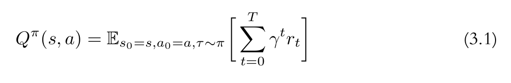
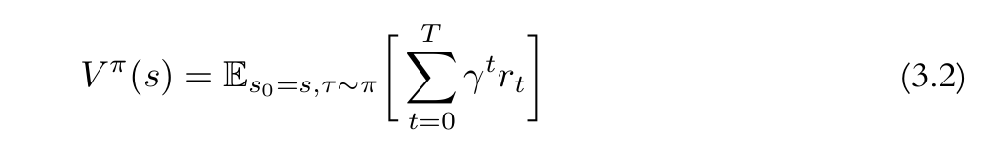
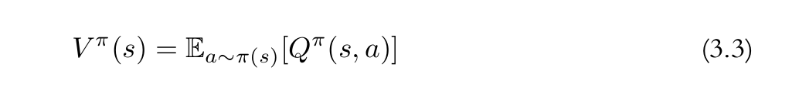

+ 记得我们在最开始介绍RL的时候，对RL的方法做过分类，共分为两种，一种是Policy-Based，而另一种则是Value-Based。之后我们介绍了REINFORCE。这是一种Policy-Based的方法。那么我们来看看Value-Based方法。今天的内容就是SARSA。

+ 大家可能有些疑问，这两种类别的方法，他们的主要区别在哪呢？这个问题确实需要进行一下解释，我们一步一步来。

+ 首先看一下什么是Value function。大家如果看过一些文献资料的话，可能会看到在介绍Value function的时候，通常会有Q-value和V-value。乍一看，两者还是不太容易区分的。下面是我个人的一些理解，如果确实理解不了的可以用我这种思路去理解一下。

+ 这是Q-value的定义，他是一个expectation，如果你将s和a从公式中拿掉，其实就是REINFORCE中的 $J(\theta)$

+ 然后我们再看V-value的定义，相比于Q的形式，他少了一个a

+ 如果从形式上看的话，这就是两者的区别。但是仍然需要解释这样的不同在设计上会产生怎样的不同。上边Q和V的区别其实就是不同情况下的expectation。Q是在某个state s 下，采取了某个特定的action a 的情况下计算出的；而V则是在state s 下计算出的。简单来说，V就是对Q取均值

+ 但是上面的解释仍然十分抽象。对，如果仅仅从公式中看的话，确实是；所以我们用一个简单的例子来说明一下。假设我们正在尝试解决某个Env，假设就是我们之前竖竹竿的问题。那么Q和V在里边的用途就是用来估计得分的。我们先从Q出发，他的意思就是，当我们看到某个observation时，通过policy产生一个action并apply之后对得分的估计。而V则是当我们看到某个observation后，尝试每一个action并应用后的得分的均值。然后根据我们开始的观察发现，如果拿掉计算Q-Value中的state和action，其实就是REINFORCE中的$J(\theta)$。我们可以这样来描述Value function和REINFORCE之间的关系：REINFORCE是通过公式推导来获得$J(\theta)$的，而Q-value则是直接让一个policy来预测这个$J(\theta)$的值。

+ 如果简化起来就是:
+ REINFORCE => Policy => 概率分布 => 得到$J(\theta)$
+ Q-Value => Policy => 得到$J(\theta)$

+ 当然，这种说法可能不太严谨，但是足够我们理解了

+ 如果说你已经理解了Value function，那我们进行下一步。进一步区分一下Q和V的不同。我们根据刚刚描述的，Q是采取了某一步action后对Value的估计。而V则是某个state下的均值。所以他们的使用场景是不一样的。
+ 在Q的情况下， 如果某个action得分更好，那我们肯定选择这个action对吧。这是很直觉的想法。但是V如何来使用呢？
+ 当我们考虑V的时候，他只是一个平均的情况，我们当然可以选择某个action，使得他可以得到比均值更高的value。但这个情况光有一个评估V的方法很明显是不够的，因为你不知道如何选择才能使获得的value比均值更高。所以，V value的情况通常需要和其他选择机制配合起来使用，让我们能够选择一个得分比均值更高的action。这就是更加先进的RL方法了。先不管。

+ 所以，总结了Value function以及Q 和V的区别之后。我们接下来首先关注Q function的一些方法。因为我们提到了要对Q value进行估计，也就是NN要预测执行了某个action之后的得分情况。所以，为了训练这个NN，我们需要input和label。input很容易获得，就是Env的state，他是每次观察得到的。但Label呢？我们其实不知道每次做的某个action之后的得分啊。那如何来解决呢？所以，接下来的问题就是，如何来获得这个真实的Q-value，从而为NN的训练提供监督信号。

+ 我们先做一个假设，假设我们的NN已经能够正确预测Q-value。然后根据accumulated reward的计算公式，他是一个带折扣的reward和对吧。那么第N次的预测和第N+1次的预测之间有什么联系呢？

+ 很显然，他满足上面这个公式，简单来说，Q-value是递归的，如果我们想要计算第N次的Q-value，那我们需要知道第N+1次的Q-value。完全展开的话，如果我们最开始就要知道Q-value的值，那我们就需要知道最后一次的Q-value的值对吧。也就是说，只要Env这个问题最终能够被解决(知道最后一次的Q-value)，那么NN就能够被训练。请记住这个描述，他很重要，也是一个重要的前提。

+ 上面的描述貌似只是描述了一个预测Q-value的NN能被训练的条件，仍然没有解答如何找到Q-value的训练数据的问题。其实方法就是用N+1次的Q-value来产生第N次的Q-value label。也就是我们上面提到的那样。这种方法通常被称为(Temporal Difference Learning, TD)，如果你理解这个方法的话，你可能会觉得有点难以相信，在我们不知道Q-value的情况下，竟然可以用Q-value自己来产生Q-value。不仅如此，这种方法还能使得Policy收敛。当然，要讨论这个理论的正确性是一个十分复杂的过程(这里我会给一个很直觉的判定方法)。

+ 但是好在很多资料里边可能会提供一些intuitive的例子，最典型的就是走迷宫。当我们考虑某个位置真实的Q-value时，我们会用到下一个位置的Q-value来产生当前位置的Q-value。这一过程看似毫无道理。但是不妨想一下，那是因为Agent探索的不够多。假设某一次Agent已经站在了迷宫的出口，那么他下一步就可以走出迷宫，这个时候，一切都变得合理了。当他有了最后一个step的Q-value，它就可以更新上一个位置的Q-value，并以此类推，可以计算出所有位置的真实Q-value。

+ 这种方法其实会贯穿我们后面的很多方法。大家如果能理解当然最好，如果不能理解，可以将这个方法理解为我之前提到的递归。在我们计算某个Q-value的时候，我们需要下一个Q-value，这是一个很明显的递归问题。也就是会用到TD这个方法来解。

+ 所以，这里做一个总结，Value function的学习和我们之前的Policy Gradient方法其实在原理上很相似，都是要更新参数，使得得分越高越好。而Value function学习的难点在于，我们无法知道每一步的Q-value的值，并且这个Q-value的值是递归定义的。那么为了产生Q-value的label，我们使用了TD这个方法，用下一步的Q-value来生成一个当前的Q-value。而要保证他的收敛，我们至少需要保证里边有一个Q-value是可以被明确计算的。

+ 这里简单介绍了Value function的一些内容。包括后面训练会用的的TD方法已经一些直觉上的探讨。后面我们会看到具体的Q-value function learning的实现。