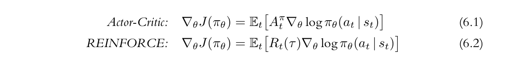
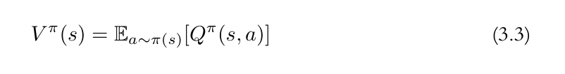
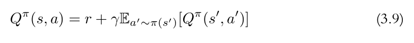
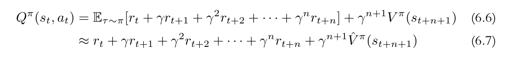

+ 在之前的blog中，我介绍了一下基于Policy Gradient和基于Q-learning的RL方法。其中REINFORCE是典型的Policy Gradient方法；而SARSA和DQN则是Q-learning的方法。这两类方法除了单独使用外，还可以组合起来使用。今天就来介绍第一个组合方法：Advantage Actor-Critic(A2C)

+ 之所以说他是一个组合的方法是因为他里边既会学习Value function，也会学习一个Policy。实际上，如果我们把Value function 的部分拿掉，它其实就是REINFORCE。所以为了讲清楚它，我们还得从REINFORCE着手。

+ 首先来看下A2C和REINFORCE的Policy Gradient:


+ 他们唯一的区别就是累计得分的计算方式不同，这一点我们之前在将REINFORCE的时候并没有提到，那就是中心化累计得分，其实就是减去均值。所以，如果我们把上边的A换成R减去均值来看的话，他们两个的目标其实时一样的。那么现在问题就来到了如何计算这个均值。

+ 一个很简单的方法就是对采样的trajectory直接计算，因为我们能计算出每一步的累计得分，那么很自然就能算出均值，然后减去它。但是为什么非要减去一个均值呢？因为统计中，我们对于某个单一的值并不感兴趣，而且但从这个值来看，也没用。所以我们通常会看他的一些总体特征，比如均值或者方差等。而均值其实反映的是距离中心点的位置，我们考虑他主要是为了估计随机变量或者叫采样点距离中心点的距离。而这反映到累计得分里边，其实就是看我们目前的得分相比于平均情况的得分是往好的方向发展还是坏的方向发展。

+ 然后我们回顾之前REINFORCE的内容，我们是通过最大化Policy gradient的方式来实现更新的对吧。那么当得分比平均情况要好，且state出现的概率更大时；就应该继续朝着这个方向继续优化对吧。反之，如果得分比平均情况更糟；那么我们就需要朝着相反的方向优化对吧。

+ 如果你已经熟悉REINFORCE的原理，那么上面的解释或许你就知道为什么了。A2C更加advanced的一面是它引入了均值，从而影响Policy的优化方向。但是它与上面直接根据trajectory数据直接计算均值的方法又有不同，他的均值计算是通过Value function进行的。所以说他是一个混合方法。所以，接下来就看他的均值是如何计算的。

+ 如果你清楚Value function的内容，那你一定还记得我们提到过，V-value其实就是当前state下，累计得分的均值。所以，与Q-learning不同，这里我们需要的是V-learning的方法。但是有了V-value还不够，我们还需要计算在某个state下，采取某个action后的累计得分，也就是一个Q-value。只有同时有了Q-value和V-value，我们才能计算A2C中的A（如果对与Q和V的区别有所困惑的，可以看看我们之前对于Q和V的介绍）。

+ 那么如何来计算Q和V其实就成了这个算法的重点。当然，你经历过Q-learning，所以你肯定能想到通过一个神经网络来近似Value function。但是这里需要两种Value值，是不是需要单独训练两个不同的神经网络来近似Value function呢？答案是不用。

+ 这里不得不回顾一下Q和V的定义：


+ 上面介绍了Q和V的不同，这里给出他的具体公式。可以看到，V和Q是有联系的，而且V是根据所有的Q值取均值得到的。那么我们很直觉的就是通过SARSA或者DQN计算每一个state下的Q值，然后去算他们的算数平均得到V值。这个方法可以尝试一下，但是它存在一些问题，你需要注意到，他的计算参数实际上对state和action都有影响，简单来说，这个值不仅仅是简单通过计算Q的算术平均数来计算的，它其实还考虑了state和action的出现概率(这是一个很明显的问题，但是大多数的人包括我，在考虑均值的时候仍然会考虑算数平均，但其实期望是一个加权平均，但是这里我并未否定使用算数平均方法的可行性，因为我没试验过，也可能是有效的，因为不管是Q-value还是V-value，在近似的时候都不是准确的)。

+ 所以，上面我们讨论了，通过计算Q来估计V是不太行的。至少从值的准确性上来讲的话。所以，A2C采取估计近似V值，然后通过V值来估计Q值。那么如何来做呢？



+ 注意上面的两个公式，第一个是V的定义，它表明V是Q的均值，然后我们讨论了从Q中估计V值可能存在问题；第二个则是Q的定义，他表示当前得分加下一次得分均值，而下一次得分的均值其实就是下一个state下的V，简单写一下就是

$$Q=r+V_{next}$$

+ 而这使得我们的Q和V的产生变成了可能。我们只需要估计一个V值，然后根据当前state下采取action得分，就可以估计出Q了。其实到这里就已经讲清楚了A2C的方法，包括他和REINFORCE的不同之处在于它对累计得分做了中心化，以根据得到的得分产生不同的优化方向；其次，我们讨论了如何产生用于中心化的均值，并讨论了如何来计算这个均值更加合理。

+ 那么下面就介绍一下一个通过V来估计Q的方法：n-step return。你如果只是理解如何从V估计出Q的话，那么我们上面的讨论就已经足够了。但是实际上，V是估计出来的，有误差，所以他的值其实是有偏的，所以我们需要尽可能消除估计出的值V对与Q计算的影响。如果你还记得Q-learning方法的话，那你一定也还记得TD。我们之前的讨论一直在反复强调如何来看待TD，它就是递归。而我们要计算Poligy gradient，也是需要一个trajectory的，也就是说，我们其实可以计算出每次的准确的reward，并由此可以计算准确的累计误差。那么我们不妨将
$Q=r+V_{next}$展开，就可以得到这个：


+ 这个的上部分就是展开的公式，下面则是通过估计的V替换，所以下面用的是约等于符号。乍一看你可能觉得还是很复杂，但是你只要记住，他就是我们之前提到的$Q=r+V_{next}$，只是展开了部分而已。那为什么要展开呢？其实就是我们提到的用于V近似的实现是有偏的，而通过展开，我们将部分值使用真实的reward替换，那么他就是无偏的。这个方法其实就是在有偏数据和无偏数据，高方差与低方差做了权衡(估计的V：低方差+有偏，真实的reward：高方差+无偏)。另外再说一点，正是因为真实reward的高方差，才会想到要将它做中心化。

+ 除了n step return的方法，还有其他的方法用于估计Q值，但是这里就不做介绍了，感兴趣的可以自行搜索，他们其实都是基于$Q=r+V_{next}$，只不过仍然是对方差和均值做了权衡的做法。

+ 讲到这，A2C为什么会产生，以及它如何实现已经基本上讲完了。接下啦就是用代码实现的问题了。

```python


def softplus( x ):
    return torch.log( 1 + torch.exp( x ) )

class Policy( torch.nn.Module ):

    def __init__(self, in_dim , out_dim):

        super( Policy , self ).__init__()

        self.linear1 = torch.nn.Linear( in_dim , 256 );
        self.linear2 = torch.nn.Linear( 256 , 256 );
        self.linear3 = torch.nn.Linear( 256 , 256 );
        self.linear4 = torch.nn.Linear( 256 , 256 );
        
        self.linear = torch.nn.Linear( 256 , out_dim );

    def forward( self , x ):
        
        feature = x;
        feature = F.relu( self.linear1( feature ) );
        feature = F.relu( self.linear2( feature ) );
        feature = F.relu( self.linear3( feature ) );
        feature = F.relu( self.linear4( feature ) );
        
        return self.linear( feature );

class Critic( torch.nn.Module ):

    def __init__(self, in_dim):

        super( Critic , self ).__init__()

        self.linear1 = torch.nn.Linear( in_dim , 256 );
        self.linear2 = torch.nn.Linear( 256 , 256 );
        self.linear3 = torch.nn.Linear( 256 , 256 );
        self.linear4 = torch.nn.Linear( 256 , 256 );
        self.linear5 = torch.nn.Linear( 256 , 256 );
        
        self.linear = torch.nn.Linear( 256 , 1 );

    def forward( self , x ):
        
        feature = x;
        feature = F.relu( self.linear1( feature ) );
        feature = F.relu( self.linear2( feature ) );
        feature = F.relu( self.linear3( feature ) );
        feature = F.relu( self.linear4( feature ) );
        feature = F.relu( self.linear5( feature ) );
        
        return self.linear( feature );

```
+ 首先仍然是Policy和V function的定义，这个名字不重要，我写成Critic也是想和A2C中的critic做对应。


```python

gamma = .99
lam = .95;
beta = .01
device = 'cuda'

```
+ 接下来就是需要用到的一些变量


```python

env = gym.make("CartPole-v1", render_mode="human")

policy = Policy( env.observation_space.shape[0] , env.action_space.n ).to( device );

critic = Critic( env.observation_space.shape[0] ).to( device )

optimizer = torch.optim.Adam( list( policy.parameters()) + list( critic.parameters()) , lr = 1e-5 );

observation, info = env.reset(seed=42)

for epoch in range( 40000 ):

    done = False ;

    # for loss computation
    logits = []
    values = []
    rewards = []
    dones = []
    log_probs = []

    entropies = []

    observation , info = env.reset()
    policy = policy.train();

    while( not done ):

        state = torch.from_numpy( observation ).to( device )

        logit = policy( state );

        value = critic( state );

        values.append( value );

        dist = torch.distributions.Categorical( logits = logit );

        entropies.append( dist.entropy() )

        action = dist.sample();

        # apply action
        next_observation, reward, terminated, truncated, info = env.step( action.item())

        # print( reward )

        with torch.no_grad():
            next_value = critic( torch.from_numpy( next_observation ).to( device ) );

        done = terminated or truncated;

        rewards.append( reward )

        dones.append( done )

        log_probs.append( dist.log_prob( action ) );

        observation = next_observation;
    

    # loss 

    log_probs = torch.stack( log_probs ).to( device );
    rewards = torch.tensor( rewards , dtype = torch.float32 , device = device );
    values = torch.cat( values ).to( device  );
    dones = torch.tensor( dones , dtype = torch.float32 , device=device );

    v_target , adv = n_step_return( rewards , values.detach() , next_value.detach(), dones )

    # 1. policy gradient + entropy loss
    policy_loss = -(log_probs * adv.detach()).mean() - beta * torch.stack( entropies ).mean() ;

    # 2. value loss
    v_loss = F.mse_loss( values , v_target , reduction = 'mean' );
    
    loss = policy_loss * .8 + v_loss ;
    
    if( ( epoch + 1 ) % 1 == 0 ):

        optimizer.zero_grad();
        loss.backward();
        optimizer.step();

        print( f'epoch :{ epoch }, loss : { loss.item() / 1 } , reward: { rewards.sum() / 1 }' )

    if( (epoch + 1) % 100 == 0 ):

        test( policy , env );

    if( (epoch + 1) % 1000 == 0 ):
        beta /= 2;

env.close()

```

+ 接着是整个的训练过程，我们首先创建Env，Policy和Critic。然后就是运行这个Env收集数据，主要包括log_prob，reward以及v-value。这里需要计算两个loss，一个就是和REINFORCE中一样的Policy gradient；而另一个则是V-value的估计误差。其中Policy gradient不仅考虑了原本的内容，我们还加了一个entropy loss。这个其实是和eps-greedy类似的操作，我们需要保证entropy不能太小，也就是概率分布要偏向于均匀，这样agent才能探索到跟多的state，当然你也可以不加。

```python


def policy_gradient( log_probs , rewards , dones ):

    T = len( rewards );

    ret = torch.zeros( T , dtype = torch.float32 ).to( rewards.device );

    fut_return = 0;

    for t in reversed( range( T ) ):
        fut_return = rewards[t] + gamma * fut_return * ( 1 - dones[t] );
        ret[t] = fut_return;

    ret = ret * log_probs;

    return ret;


def n_step_return ( rewards , values , next_value , dones ):
    
    T = len( rewards )

    fut_return = next_value;

    v_target = torch.zeros( T , dtype = torch.float32 ).to( rewards.device );

    for t in reversed( range( T ) ):
        fut_return = rewards[t] + gamma * fut_return * ( 1 - dones[t] )
        v_target[t] = fut_return

    adv = v_target - values;

    return v_target , adv;


def gae( rewards , values , dones ):
    
    T = len( rewards )

    # values = [ values , next_values ]
    assert T + 1 == len( values )

    adv = torch.zeros( T , dtype = torch.float );
    
    fut_return = 0;

    for t in reversed( range( T ) ):

        # delta_t = reward + gamma * V_t+1 - V_t 
        delta = rewards[t] + gamma * values[t+1] - values[t];

        # A_PI_t = delta + gamma * A_PI_t-1
        fut_return = delta + gamma * lam * ( 1.0 - dones[t] ) * fut_return ; 

        adv[t] = fut_return;

    v_target = adv + values[:-1];

    return v_target , adv 


@torch.no_grad()
def test( policy , env ):

    policy = policy.eval();

    observation , info = env.reset()

    done = False;

    rewards = 0;

    while( not done ):
        
        logits = policy( torch.from_numpy( observation ).to( device ) )

        action = logits.argmax();

        observation, reward, done, truncated, info = env.step(action.item())
        rewards += reward;

    print( f'testing rewards : { rewards }')


```
+ 接着就是我们训练中用到的一些方法，有n_step_return和text。其中n_step_return计算V-value的target和A值；test则用于测试。除此之外，还给出了REINFORCE的Policy gradient计算方法，你可以和A2C的实现对比一下， 其实一摸一样的；以及另一种V和Q的计算方法Generalized Advantage Estimation，简称GAE。

+ 从训练过程来看，A2C相比于REINFORCE，收敛更快。

+ 接下来就是一些额外的讨论以及分析内容。你如果不敢兴趣，可以直接跳过

+ 你可能会在某些资料上看到一些分析，说之所以选择学习V-value而不是Q-value是因为V-value学起来比较简单。但是这和我们之前介绍Q-learning的直觉有区别。因为按照SARSA和DQN的设计，他们就是用来学Q-value的。但是现在为什么又说V-value学起来更加容易。这是一个十分有必要讨论的内容，但他其实是Q-learning本身表达方式的问题。

+ 要回答这个问题，我们首先看Q的定义，他是当前的reward+下一步的V-value。而在实际实现中，我们可以看到SARSA和DQN的Q-value并不是这样定义的，他们定义成了当前的reward+下一步的Q-value，这就是根本的区别。要解释清楚这个问题，我们一方面可以从SARSA和DQN算法的目的出发，我们计算Q-value的目的是做action选择。那么agent在做action选择时，肯定会选那个使得Q-value更高的对吧。另一方面是从REINFORCE的角度，因为在它里面，我们是根据Policy Gradient来更新Policy，而为了更新，我们需要计算J，而为了计算J，我们其实需要一连串的数据，比如一个trajectory的数据。那么换个策略，我们为什么不直接学这个J呢？我觉得这其实才是Q-learning背后的原因，这样，就可以省去收集trajectory的步骤，而我们要估计的也不是一个真实的Q-value或者J，因为涉及到选择性，只需要能够比较就可以了。所以，Q-learning的目的可以粗略得概括为：1. 近似拟合J或者Q-value。2. 在每个状态下去学一个分布，这个分布可以用来做action选择。前者是从公式和算法设计出发，而后者是从直觉出发考虑的。