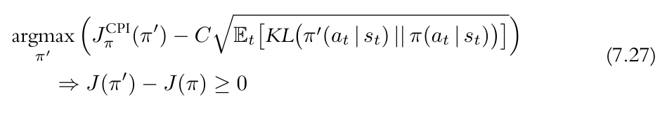
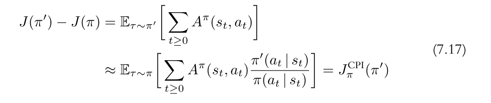
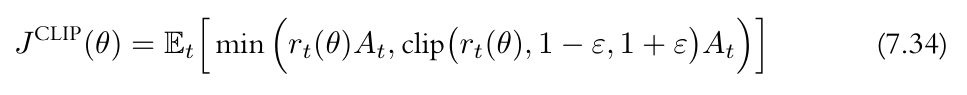
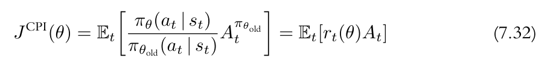

+ 这个blog主要来介绍一下PPO，这个算法要讲清楚的话还是挺难的。所以，为了让我们能够理解这个算法，我们尽量撇开复杂的公式推导，主要理解一下算法设计的思想就行了。除此之外，我们也给出该算法的相关代码。

+ PPO是由A2C算法改进得来的，这里我们先回顾一下A2C算法。我们之前介绍了A2C是REINFORCE的Advance版本。就是对reward做了中心化。这样可以使得训练过程更加平稳。那么PPO相较于A2C又做了哪些改进呢？其实很简单，PPO就是说，我们每次更新Policy的时候，很难控制每次更新的程度。假设Policy突然变差了，那么它产生的trajectory也可能是无用的。这个问题通常称为Performace collapse。PPO就是为了解决这个问题，这个算法的想法就是，Policy每次更新程度不能太大，以避免Performace collapse的问题。

+ 所以，在PPO里边，存在两个Policy，一个是旧的Policy，而另一个就是更新后的新Policy。因为我们要防止他过度更新，所以在算法中，通常要求两个Policy的分布要尽可能接近。但是这个目标显然不够，因为只是要求两个Policy分布尽可能得接近是完全不够的，只要我们的更新信号为0，那么前后两次Policy的分布就是一样的，但是这样是无意义的。所以，他的另一个目标就是更新后的Policy要比先前的Policy要好。而在A2C或者REINFORCE里边，我们衡量Policy的好坏就是用的累计得分J对吧。那么综合起来，PPO的目标其实就是：

+ 1. 更新后的Policy的累计得分要比先前的Policy的得分要高；
+ 2. 为了缓解Performace collapse问题，需要更新前后的两次Policy的分布尽可能接近。

+ 那么，PPO的目标函数大概就可以写成这样



+ 而这个 $ J^{CPI} $ 其实就是：



+ 这个公式的理论和推导过程还是比较复杂的，所以我们这里对里面的内容做一些解释，如果你想更加完整得了解相关的理论和推导过程，请查看更加详细的资料。

+ 上面计算 $ J^{CPI} $ 的公式中，用了一个理论，名叫importance sampling。这个理论就是说，当我们无法计算一个概率分布的准确形式的时候，我们可以用一个形状相似的概率分布来近似这个概率分布，因为形状相似，所以两者相差的只有一个乘法因子，或者说一个系数。当然，这是一种很简单的描述方式，只是方便理解。因为PPO需要保证前后Policy的分布不能相差太大，所以他可以满足形状相似的条件，也就可以使用Importance Sampling方法来做近似。这就是$ J^{CPI} $为什么会在后面加上一个新旧Policy的比值。

+ 然后就是 $ A^{\pi} $，如果你知道A2C的话，那你应该知道这个A是如何得来的，但是我们这里需要解释一下他的含义。因为从公式中可以看到，我们要求是前后两次的Policy相比，新的Policy要比旧的Policy要好对吧。那么这个好应该如何来衡量呢？这就需要用到A function。但是这里问题就来了，既然我们有了两个Policy，那应该如何计算这个A的值呢？答案是用旧Policy的值来计算A值。

+ 然后，大多数人(包括我),可能就会想，从逻辑层面能够理解这个算法：就是我们要更新一个Policy，让他的更新小一点，以保证不产生Performace collapse问题，但是更新程度小是一方面，我们的目标是要使得新的Policy比旧的Policy的累计得分更高，所以，总结起来就这两点。但是，当我们将这个想法带入到公式中的时候，事情就变得诡异起来了。前一个问题，要使前后Policy的分布接近，用一个KL divergence就可以办到了；而要让新的Policy优于旧的Policy，那么就是要使新旧两者Policy的累计得分差越大越好，或者说至少大于0。

+ 所以重点是如何衡量前后累积分布的差呢？因为这里存在一个矛盾的地方，假设我已经完成了Policy的更新，那我还来计算新旧Policy的得分差有什么意义呢？你如果想到这里了，那么恭喜你，你和我一样，也走到误区中了。这里我简单说一下我的理解。

+ 我们要做的不是根据新旧Policy的累计得分差来更新旧的Policy，而是要根据新旧Policy的得分差来修正新的Policy。试想一下，我们为了尽可能选择最优的方向来更新Policy，那么一旦我们某一步选择了一个稍差的方向，我们的第一想法就是维持目前最优的Policy对吧，然后重新对trajectory采样，并重新更新对吧。而为了保证我们可以随时从新的Policy回滚到旧的Policy，那么就要求前后两次Policy的分布的距离不能太大，这是其一。其二就是目标函数的设计，他估计的是前后两次Policy的得分差，如果新的得分更大，那自然好，表示这个Policy更好；如果新的得分较小，那么表示这个新的Policy更差，也就意味着他需要产生一个回滚的信号，或者其他方向的更新。这种设计其实就保证了，如果产生了一个差的Policy，就需要迅速修正它，以保证他的更新总是朝着正确的方向更新的。说到这里，我觉得PPO的设计思想应该是讲完了，但这是我自己的理解，可能是有误的。

+ 那么，下一步就是解释，为什么要用旧Policy的值来计算A了。这一点不同的是，我个人认为，理论上应该是不用说一定限制在旧的Policy上去计算A的值，这一点我问过ChatGPT，他的解释是理论上是无所谓的，但是实际上可能会对算法收敛性产生一些影响。这显然是不够直观的，所以，我这里给一个稍微直观的解释。在计算A值的时候，其实我们只有旧Policy的数据，新的Policy虽然已经有了，但是没有trajectory的数据，所以，为了方便，我们可以直接使用旧的Policy来计算A值，这是一方面；另一方面，就是上面提到的，我们计算新旧误差的差值是为了评估更新后的Policy相比于旧的Policy是否更优，那么评价标准自然是以旧Policy为准，所以A值仍然沿用旧的。

+ OK，讲到这，我觉得相关的内容大多已经讲完了。事实上，你在上面看到的内容应该称为TRPO，也就是Trust regin policy optimization。他表示了更加一般的情况。PPO则是在他的基础上做了一些简化。毕竟计算两个分布的KL divergence也不是一个简单的事。

+ 所以，PPO的一个简化版本的公式是这样的：



+ 其中，r的定义是这样的，就是新旧Policy的比值:



+ 相比于上边的公式，它不需要KL divergence，而是直接对新旧Policy的分布比值做CLIP。好了， 这就是我所知道的关于PPO的所有内容了。接下来就是他的具体实现。

```python

class PolicyCriticNetwork( torch.nn.Module ):
    def __init__(self, state_dim , action_dim , critic_dim ):
        super( PolicyCriticNetwork , self ).__init__();
        self.shared_layers = torch.nn.Sequential(
            torch.nn.Linear( state_dim , 128 ),
            torch.nn.ReLU(  ),
            torch.nn.Linear( 128 , 128 ),
            torch.nn.ReLU(  ),
            torch.nn.Linear( 128 , 128 ),
            torch.nn.ReLU(  )
        )
        self.policy_layers = torch.nn.Sequential(
            torch.nn.Linear(128 , action_dim )
        )
        self.critic_layers = torch.nn.Sequential(
            torch.nn.Linear( 128 , critic_dim )
        )

    def forward( self , state ):
        features = self.shared_layers( state );
        return self.policy_layers( features ) , self.critic_layers( features );

```

```python

# env = gym.make( 'CartPole-v1' , render_mode = 'human' );
env = gym.make( 'CartPole-v1' );
state_dim = env.observation_space.shape[0];
action_dim = env.action_space.n;
critic_dim = 1;
lr = 1e-4

model = PolicyCriticNetwork( state_dim , action_dim , critic_dim );
optimizer = torch.optim.Adam( model.parameters() , lr = lr )


```
```python

def n_step( rewards , next_v_pred , terminations , gamma ):
    N = len( rewards );
    fut = next_v_pred;
    rets = []
    for t in reversed( range( N ) ):
        fut = rewards[t] + gamma * fut * ( 1 - terminations[t] ) ;
        rets.insert( 0 , fut );
    return torch.tensor( rets );

def n_step_adv( rewards , v_preds , next_v_pred , terminations , gamma ):
    v_target = n_step( rewards , next_v_pred , terminations , gamma );
    adv = v_target - v_preds;
    
    return adv , v_target;

def compute_gae(rewards, dones, values, next_value, gamma, lam):
    advantages = []
    gae = 0
    for i in reversed(range(len(rewards))):
        delta = rewards[i] + gamma * next_value * (1 - dones[i]) - values[i]
        gae = delta + gamma * lam * (1 - dones[i]) * gae
        advantages.insert(0, gae)
        next_value = values[i]
    advantages = torch.tensor(advantages, dtype=torch.float32);
    v_target = advantages + values;
    return advantages , v_target

```

```python

gamma = .99
lam = .95
cliped_eps = .2;
mse_criterion = torch.nn.MSELoss( reduction = 'mean' )

def test( model ):
    model = model.eval();
    done = False;
    state , info = env.reset();
    total_rewards = 0
    while not done :
        state = torch.tensor( state );
        param , v_pred = model( state );
        action = param.argmax().item();
        state , reward , done , truncated, info = env.step( action );
        total_rewards += reward;
        env.render()

    print( f'Evaluation: {total_rewards}' )

def train( 
    model : torch.nn.Module ,
    epoch : int 
    ):

    model = model.train()
    rewards , states , actions , terminations , v_preds , log_probs = [] , [] , [] , [] , [] , []
    state , info = env.reset();
    terminated = False;
    while not terminated:
        state = torch.tensor( state );
        with torch.no_grad():
            pd_param , v_pred = model( state );
        dist = torch.distributions.Categorical( logits = pd_param );
        action = dist.sample();
        log_prob = dist.log_prob( action );

        next_state , reward , terminated , truncated , info = env.step( action.item() );

        states.append( state );
        rewards.append( reward );
        actions.append( action );
        terminations.append( terminated );
        log_probs.append( log_prob );
        v_preds.append( v_pred );

        state = next_state;
    
    with torch.no_grad():
        _,next_v_pred = model( torch.tensor( state ) )

    states = torch.stack( states )
    rewards = torch.tensor( rewards );
    actions = torch.tensor( actions );
    terminations = torch.tensor( terminations , dtype = torch.float );
    log_probs = torch.tensor( log_probs )
    v_preds = torch.cat( v_preds );

    # adv , v_target = n_step_adv( rewards , v_preds , next_v_pred , terminations , gamma );

    adv , v_target = compute_gae( rewards , terminations , v_preds , next_v_pred , gamma , lam )
    adv = ( adv - adv.mean() ) / ( adv.std() + 1e-8 )

    # update 
    for _ in range( 20 ):
        param , v_preds = model( states );
        dist = torch.distributions.Categorical( logits = param );
        new_log_probs = dist.log_prob( actions );

        r = torch.exp( new_log_probs - log_probs );
        cliped_r = torch.clamp( r , 1 - cliped_eps , 1 + cliped_eps );
        policy_grad = torch.min( r * adv , cliped_r * adv );
        policy_loss = -torch.mean( policy_grad );

        value_loss = mse_criterion( v_preds.squeeze( -1 ) , v_target );

        entropy_loss = dist.entropy().mean();

        loss = policy_loss + .5 * value_loss - .1 * entropy_loss;

        optimizer.zero_grad();
        loss.backward();
        optimizer.step()

try:
    for epoch in range( 1000 ):
        train( model  , 0 );
        if( (epoch + 1) % 10 == 0 ):
            test( model );
finally:
    env.close();

```

+ 这个代码有部分要解释。从风格上看的话和其他blog的内容有一些区别，这是我之前写的。train方法里边就是训练过程，update下面更新20次就是PPO的执行过程，